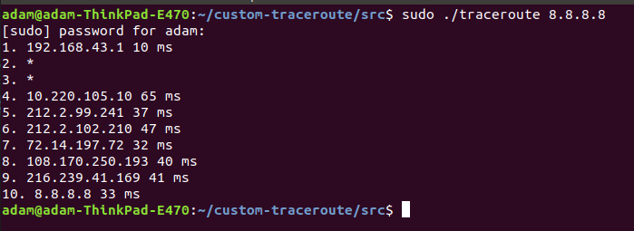

# custom-traceroute
> This program is my own implementation of traceroute tool using ICMP packets.
Traceroute is a command line Linux diagnostic network tool for discovering possible routes of packets in the Internet: https://en.wikipedia.org/wiki/Traceroute

## Table of contents
* [General info](#general-info)
* [Technologies](#technologies)
* [Requirements](#requirements)
* [Installation](#installation)
* [Comments](#comments)

## General info
* All routers present on path between sender and receiver are printed to stdout in following format: _<router ordering number> <router IP address> <average reponse time>_ See below screenshot for more details.

## Technologies
* ANSI C with standard & network libraries

## Requirements
* Operating system: Linux
* Compiler: gcc 7.5.0 or similar

## Installation
* Download source code from _src_ folder
* Run Terminal & go to _src_ directory (e.g. _cd ~/Downloads/src_)
* Build _traceroute_ binary using command: _make_
* Run _make clean_ to remove all unnecessary compilation products
* Run _traceroute_ binary with _sudo_ (_ICMP_ packets are send by raw sockets which requires administrator privileges). Pass one argument representing destination IP address (e.g.  _sudo ./traceroute 8.8.8.8_).

## Comments
* Use _make distclean_ command to remove all build artifacts